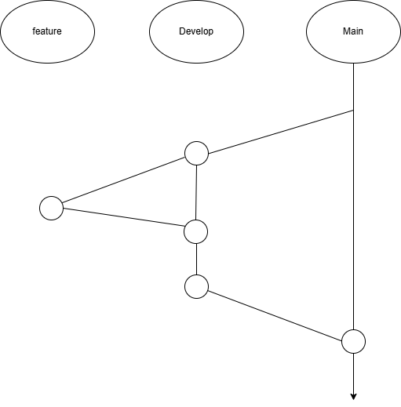

## Kiosk
___
### 프로젝트 개요
#### 프로젝트 명 : KioskProject
#### 프로젝트 목적
- 기초적인 프름 제어 및 객체 지향 설계 개념을 복습
- **추상화, 캡슐화, 상속, 다형성** 을 고민하고 설계
- 클래스 간 역할 분리 이해, 적절히 협력하는 객체 설계
- 프로그램 상태 변경 및 데이터 저장 연습
- 사용자 입력에 따른 예외 처리와 조건 분기 연습
- **lambda stream Enum을** 통해 프로그램 효율성과 가독성 개선

___
### 필수기능
### LV1
- **입력 처리와 간단한 흐름 제어를 복습합니다. (프로그래밍 검증)**
  - [X] `Scanner` 활용법, 조건문, 반복문을 재확인하며 입력 데이터를 처리하는 방법 강화
- **햄버거 메뉴 출력 및 선택하기**
  - [X] 여러 햄버거 메뉴를 출력한다
  - [X] `Scanner`를 사용하여 사용자에게 입력을 받는다
  - [X] 제시된 메뉴 중 입력받은 숫자에 따라 다른 로직을 실행하는 코드를 작성합니다.
  - [X] 반복문을 이용해서 특정 번호가 입력되면 프로그램을 종료합니다.
___
### LV2
 - **`MenuItem` 클래스 생성하기**
   - [X] 설명 : 개별 음식 항목을 관리하는 클래스입니다. 현재는 햄버거만 관리합니다.
   - [X] 클래스는 `이름`, `가격`, `설명` 필드를 갖습니다.
 - **`main` 함수에서 `MenuItem` 클래스를 활용하여 햄버거 메뉴를 출력합니다.**
   - [X] `MenuItem` 객체 생성을 통해 `이름`, `가격`, `설명`을 세팅합니다.
   - [X] `List`를 선언하여 여러 `MenuItem`을 추가합니다.
   - [X] `List<MenuItem> menuItems = new ArrayList<>();`
   - [X] 반복문을 활용해 `menuItems`를 탐색하면서 하나씩 접근합니다.
___      
### LV3
 - **요구사항이 가지는 의도**
   - [X]  객체 지향 개념을 학습하고, 데이터를 구조적으로 관리하며 프로그램을 설계하는 방법을 익힙니다.
   - [X]  `main` 함수에서 관리하던 전체 순서 제어를 `Kiosk` 클래스를 통해 관리합니다.
   - [X]  **`Kiosk` 클래스 생성하기**
   - **설명**: 키오스크 프로그램의 메뉴를 관리하고 사용자 입력을 처리하는 클래스입니다.
     - [X]  `MenuItem`을 관리하는 리스트가 필드로 존재합니다.
     - [X]  `main` 함수에서 관리하던 입력과 반복문 로직은 이제 `start` 함수를 만들어 관리합니다.
     - [X]  `List<MenuItem> menuItems` 는 `Kiosk` 클래스 생성자를 통해 값을 할당합니다.
     - [X]  `Kiosk` 객체를 생성하고 사용하는 `main` 함수에서 객체를 생성할 때 값을 넘겨줍니다.
 - **요구사항에 부합하는지 검토**
   - [X]  키오스크 프로그램을 시작하는 메서드가 구현되어야 합니다.
   - [X]  콘솔에 햄버거 메뉴를 출력합니다.
   - [X]  사용자의 입력을 받아 메뉴를 선택하거나 프로그램을 종료합니다.
   - [X]  유효하지 않은 입력에 대해 오류 메시지를 출력합니다.
   - [X]  `0`을 입력하면 프로그램이 ‘뒤로가기’되거나 ‘종료’됩니다.
___
- ### LV4
  - [ ]  **`Menu` 클래스 생성하기**
  - [ ]  설명 : MenuItem 클래스를 관리하는 클래스입니다.
  예를 들어, 버거 메뉴, 음료 메뉴 등 각 카테고리 내에 여러 `MenuItem`을 포함합니다.
  - [ ]  `List<MenuItem>` 은 `Kiosk` 클래스가 관리하기에 적절하지 않으므로 Menu 클래스가 관리하도록 변경합니다.
  - [ ]  여러 버거들을 포함하는 상위 개념 ‘버거’ 같은 `카테고리 이름` 필드를 갖습니다.
  - [ ]  메뉴 카테고리 이름을 반환하는 메서드가 구현되어야 합니다.
___
- ### LV5
  - [ ]  `MenuItem`, `Menu` 그리고 `Kiosk` 클래스의 필드에 직접 접근하지 못하도록 설정합니다.
  - [ ]  Getter와 Setter 메서드를 사용해 데이터를 관리합니다.
___
### 도전기능
추가 예정

___
### Git Flow

- main : 서비스 직접 배포하는 브랜치
- develop : feature에서 개발된 내용을 가지는 브랜치
- feature : 기능을 개발하는 브랜치 **feature/{기능요약}**
  
___
## Commit Message Convention
Udacity 의 Commit Convention

### 커밋 메세지 형식
```
type: Subject

body

footer
```
#### 메시지 type은 아래와 같이 분류된다. 아래와 같이 소문자로 작성한다.
- feat : 새로운 기능 추가
- fix : 버그 수정
- docs : 문서 내용 변경
- style : 포맷팅, 세미콜론 누락, 코드 변경이 없는 경우 등
- refactor : 코드 리팩토링
- test : 테스트 코드 작성
- chore : 빌드 수정, 패키지 매니저 설정, 운영 코드 변경이 없는 경우 등

#### Subject (제목)
- Subject(제목)은 최대 50글자가 넘지 않고, 마침표와 특수기호는 사용하지 않는다.
- 영문 표기 시, 첫글자는 대문자로 표기하며 과거시제를 사용하지 않는다. 그리고 간결하고 요점만 서술해야 한다.
```
Added (X) → Add (O)
```
___
#### Body (본문)
- Body (본문)은 최대한 상세히 적고, 무엇을 왜 진행했는 지 설명해야 한다. 만약 한 줄이 72자가 넘어가면 다음 문단으로 나눠 작성하도록 한다.
___
#### Footer (꼬리말)
- 선택사항
- Footer (꼬리말)은 이슈 트래커의 ID를 작성한다.
- 어떤 이슈와 관련된 커밋인지(Resolves), 그 외 참고할 사항이 있는지(See also)로 작성하면 좋다.
___